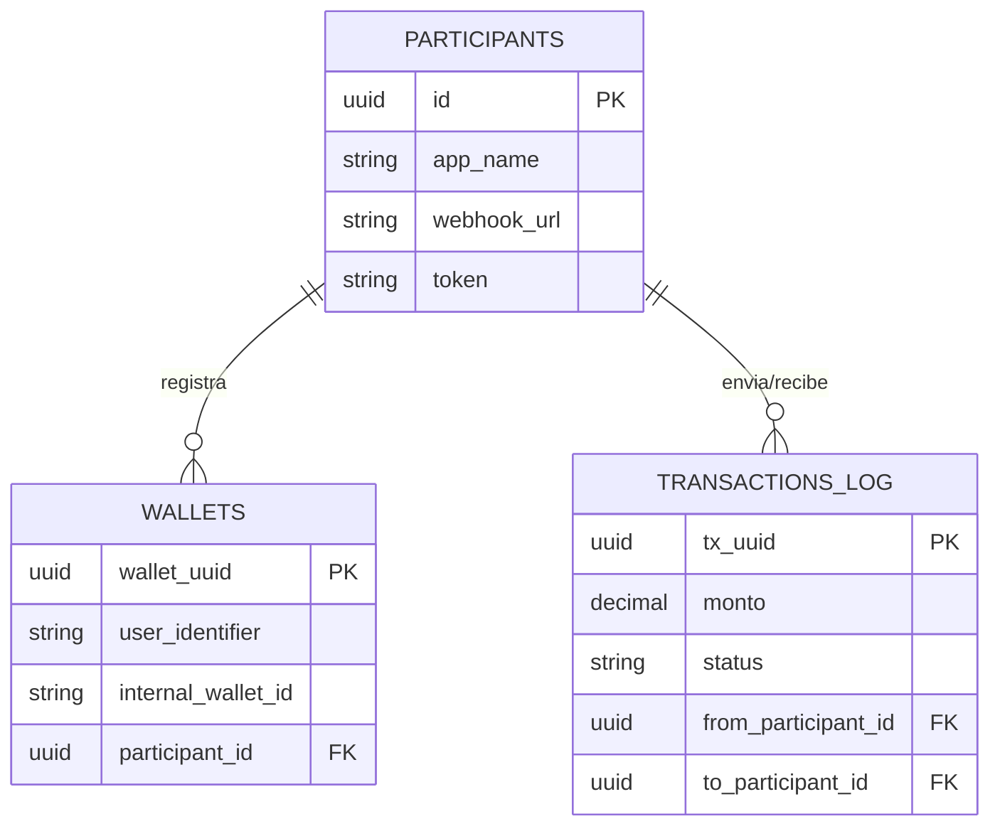

## 🌐 API Central & Protocolo de Interoperabilidad (Hub-and-Spoke)

Este proyecto móvil es solo un nodo ("Spoke") dentro de una arquitectura mayor. La lógica de enrutamiento y el directorio de usuarios reside en la **API Central**.

A continuación, detallo la documentación técnica de la API que diseñé para orquestar las transacciones entre diferentes billeteras (Simulación Fintech).

<details>
<summary><strong>👇 Ver Documentación Técnica del Backend & Base de Datos (Click aquí)</strong></summary>

### 1. Modelo de Funcionamiento
El sistema funciona como un **Directorio y Enrutador**:
1.  **Directorio:** Mapea números de teléfono a Webhooks de diferentes aplicaciones (Khipu, BilleteraB, etc.).
2.  **Enrutador:** Recibe una orden de pago de una App y la reenvía al backend de la App destino.

**URL Base:** `https://billetera-central-api.onrender.com`

---

### 2. Esquema de Base de Datos (PostgreSQL)
Diseño relacional para garantizar la integridad de las transacciones y el registro de participantes.

**Tabla: `participants` (Las Apps)**
| Columna | Tipo | Descripción |
| :--- | :--- | :--- |
| `id` (PK) | `uuid` | ID único de la app. |
| `webhook_url`| `varchar` | Endpoint para recibir dinero. |
| `token` | `varchar` | API Key para firmar peticiones. |

**Tabla: `wallets` (El Directorio)**
| Columna | Tipo | Descripción |
| :--- | :--- | :--- |
| `wallet_uuid` (PK)| `uuid` | ID único del registro. |
| `user_identifier` | `varchar` | **ID Universal:** Teléfono del usuario. |
| `internal_wallet_id`| `varchar` | ID en la BD interna (Firebase/SQL). |
| `participant_id` (FK)| `uuid` | Relación con la tabla participants. |

---

### 3. Diagrama de Entidad-Relación (ERD)


---
## 4. Endpoints Clave

A. Ejecutar Transferencia (POST /api/v1/transfer)
Orquesta el movimiento de dinero entre dos apps distintas.

```
{
  "fromIdentifier": "999888777",
  "toIdentifier": "111222333",
  "toAppName": "BilleteraGrupoB",
  "monto": 10.50
}
```


### B. Webhook de Recepción

Formato JSON estandarizado que cada App (Spoke) debe implementar para aceptar depósitos.
```
{
  "fromAppName": "Khipu",
  "internalWalletId": "firebase_uid_destino",
  "monto": 10.50,
  "centralTransactionId": "tx-uuid-12345"
}
```
</details>
