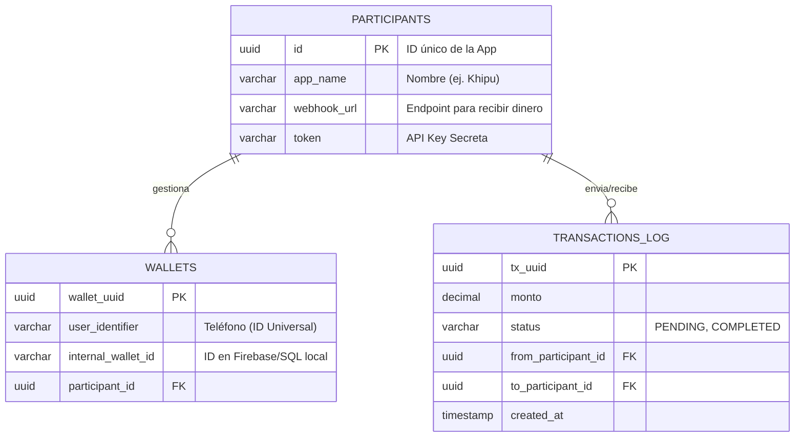

# ⚙️ API Centralizada - Hub de Interoperabilidad (Khipu)

> 📱 **Cliente Móvil:** Este es el Backend de orquestación. Puedes ver la aplicación móvil (React Native) que consume esta API aquí:  
> 👉 **[github.com/VictorAndres198/Khipu](https://github.com/VictorAndres198/Khipu)**

Esta API RESTful actúa como un **Hub-and-Spoke** (Eje y Radios) para conectar billeteras digitales heterogéneas. Funciona como un enrutador de transacciones y un directorio de usuarios centralizado, permitiendo la interoperabilidad entre sistemas SQL y NoSQL.

---

## 🛠️ Tech Stack

* **Runtime:** Node.js + Express
* **Base de Datos:** PostgreSQL (Relacional para consistencia ACID)
* **Hosting:** Render
* **Arquitectura:** MVC + Servicios
* **Seguridad:** API Keys (Header Authentication)

**URL Base (Producción):** `https://billetera-central-api.onrender.com`

---

## 1. Modelo de Funcionamiento

Este sistema **NO custodia dinero**. Su función es puramente logística:

1.  **Directorio (Discovery):** Mapea un identificador universal (Teléfono) a una dirección técnica (Webhook de la App destino).
2.  **Enrutador (Router):** Recibe órdenes de pago, valida la existencia del destinatario y reenvía la transacción al servidor correspondiente.

---

## 2. Esquema de Base de Datos (PostgreSQL)

El sistema utiliza un modelo relacional estricto para garantizar la integridad de los participantes y el registro de auditoría.


---
### Descripción de Tablas
* `participants`: Registro de las aplicaciones autorizadas (Bancos/Billeteras). Contiene sus credenciales y Webhooks.
* `wallets`: El "Directorio Telefónico". Vincula un número de teléfono con una App específica.
* `transactions_log`: Ledger inmutable de todas las operaciones cursadas por el Hub.

---

## 3. Seguridad y Autenticación

Todas las solicitudes deben incluir la **API Key** asignada al grupo en los Headers.

* **Header:** `X-API-Token`
* **Valor:** `[TOKEN_SECRETO_DEL_GRUPO]`

> 🔒 **Nota:** Si el token falta o es incorrecto, la API responderá con `401 Unauthorized`.

---

## 4. Documentación de Endpoints

### A. Registrar Usuario (Onboarding)
Notifica al Hub que un usuario nuevo se ha registrado en tu App.

* **Endpoint:** `POST /api/v1/register-wallet`
* **Body:**
    ```json
    {
      "userIdentifier": "987654321",         // Teléfono
      "internalWalletId": "firebase_uid_123", // Tu ID interno
      "userName": "Víctor Rojas"
    }
    ```
* **Respuesta (201 Created):**
    ```json
    {
      "success": true,
      "data": { "wallet_uuid": "...", "created_at": "..." }
    }
    ```

### B. Buscar Destinatario (Discovery)
Consulta si un número de teléfono existe en alguna de las apps conectadas.

* **Endpoint:** `GET /api/v1/wallets/:identifier`
* **Ejemplo:** `GET /api/v1/wallets/999888777`
* **Respuesta (200 OK):**
    ```json
    {
      "found": true,
      "wallets_disponibles": [
        { 
          "wallet_uuid": "...", 
          "appName": "BilleteraGrupoB", 
          "userName": "Juan Perez" 
        }
      ]
    }
    ```

### C. Ejecutar Transferencia (Transaction)
Envía una orden de pago al Hub para que sea enrutada.

* **Endpoint:** `POST /api/v1/transfer`
* **Body:**
    ```json
    {
      "fromIdentifier": "MiTelefono",
      "toIdentifier": "TelefonoDestino",
      "toAppName": "BilleteraGrupoB", // Nombre exacto de la App destino
      "monto": 50.00,
      "descripcion": "Pago de cena"
    }
    ```
* **Respuesta (200 OK):**
    ```json
    {
      "success": true,
      "status": "COMPLETED",
      "centralTransactionId": "uuid-central-789",
      "message": "Transferencia completada con éxito"
    }
    ```

---

## 5. Webhook de Recepción (Requisito para Clientes)

Para recibir dinero, tu aplicación debe exponer un endpoint (ej: `/api/deposit`) que acepte el siguiente formato JSON enviado por el Hub:

**Formato Entrante (Request):**
```json
{
  "fromAppName": "Khipu",
  "fromUserName": "Usuario Origen",
  "internalWalletId": "tu_id_interno_en_firebase",
  "monto": 50.00,
  "centralTransactionId": "uuid-central-789"
}
```
**Respuesta Esperada (Response): Debes responder con `200 OK` y el siguiente JSON:**
```json
{
  "success": true,
  "localTransactionId": "tu_id_interno_de_transaccion"
}
```
